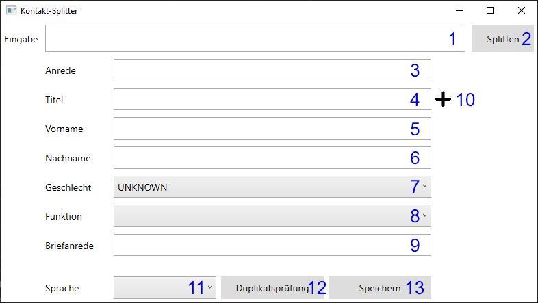

# Kontakt Splitter

## Produktbeschreibung
Dieses Programm ist im Rahmen der Vorlesung Softwarequalität an der DHBW Stuttgart Campus Horb entstanden. Die Software teilt eine Anrede in die einzelnen Kontaktdaten auf und erstellt daraus eine Briefanrede. Die Software schließt an ein bestehendes CRM-System an.

## Design
[Design.md](documentation.md)

## Funktionalitäten
* Ein Sachbearbeiter kann die Anrede einer Person angeben. Diese wird in einzelne Kontaktdaten aufgeteilt.
* Aus den Kontaktdaten wird eine standardisierte Briefanrede generiert.
* Die Kontaktdaten lassen sich von dem Sachbearbeiter bearbeiten, wodurch die Briefanrede individualisiert werden kann.
* Der Sachbearbeiter kann neue Titel hinzufügen, welche bei folgender Bearbeitung erkannt werden.
* Der Sachbearbeiter wird benachrichtigt, wenn Angeben fehlen oder nicht interpretiert werden können.

## Technische Funktionsweise
Hier ist die Oberfläche der Software zu sehen. Die beschriebenen Funktionen sind IMMER erst verfügbar, sobald ein Kontakt aufgeteilt wurde.

1. Hier wird die Anrede eingegeben. Nach Bestätigen durch den "Splitten"-Knopf (2) wird die Anrede aufgeteilt und in den Feldern 3-7 angezeigt.
2. Der "Splitten"-Knopf löst das Aufteilen der Anrede aus (siehe 1.).
3. Hier wird die Anrede der Person angezeigt. Aus der Anrede wird automatisch das Geschlecht ermittelt. Durch das Ändern des Geschlechts wird auch die Anrede angepasst. Diese kann jedoch nicht immer exakt bestimmt werden (bspw. im Englischen ist es unbekannt, ob Ms oder Mrs genutzt werden soll). Dieses Feld kann angepasst werden, hat jedoch nicht in jeder Sprache eine Auswirkung. Im Deutschen wird dieses Feld nicht genutzt, sondern nur das Geschlecht.
4. Hier wird eine Liste der Titel der Person angezeigt. In die Briefanrede wird lediglich der erste Titel übernommen. Durch Drag´n Drop lässt sich dieser Titel anpassen. Durch anklicken eines Titels wird die Briefanrede aktualisiert. Mit einem Rechtsklick lässt sich ein Titel löschen. Dieser wird zukünftig nicht mehr erkannt.
5. Hier wird der Vorname der Person angezeigt. Bei Änderung wird die Briefanrede automatisch aktualisiert.
6. Hier wird der Nachname der Person angezeigt. Bei Änderung wird die Briefanrede automatisch aktualisiert.
7. Das Geschlecht wird in einer Dropdown-Liste angezeigt. Bei einer Änderung wird die Briefanrede neu generiert. Wenn kein Geschlecht erkannt werden kann, wird als Standardwert "UNKNOWN" gesetzt.
8. Für eine Person kann alternativ eine Funktion gewählt werden. Dadurch wird die Person in der Briefanrede in dieser Funktion angesprochen. Die Funktion wird automatisch anhand des Geschlechtes angepasst.
9. Hier wird die generierte Briefanrede angezeigt.
10. Durch diesen Knopf öffnet sich ein neues Fenster in dem ein neuer Titel hinzugefügt werden kann (siehe extra Fenster). Diese Funktion steht nur zur Verfügung, wenn ein Kontakt gesplittet ist.
11. Hier wird die erkannte Sprache angezeigt. Eine Änderung hat keine Auswirkung auf den Kontakt. Das wird in einem zukünftigen Sprint hinzugefügt.
12. Dieser Knopf ist an das CRM-System angeschlossen um zu prüfen, ob der Kontakt bereits existiert. Noch besitzt dieser keine Funktion.
13. Dieser Knopf ist an das CRM-System angeschlossen um den Kontakt zu speichern. Noch besitzt dieser keine Funktion.

1. Hier wird der neue Titel eingegeben.
2. Durch den "Hinzufügen"-Knopf wird der Titel zu der Person hinzugefügt und zukünftig auch automatisch erkannt.
3. Durch "Abbrechen" wird das Fenster ohne Änderung geschlossen.

## Einschränkungen
Adelstitel werden noch nicht in ein eigenes Feld aufgeteilt, sondern dem Nachnamen zugeordnet.

Das Erkennen von mehreren Vornamen ist noch nicht implementiert. Der erste Vorname wird als Vorname gesetzt, der Rest wird als Nachname genutzt.

Die Software erkennt bisher nur deutsche und englische Anreden. Weitere Sprachen können hinzugefügt werden. Dafür muss eine Konfiguration für die neue Sprache hinzugefügt werden und eine neuen Klasse hinzugefügt werden, welche von der abstrakte Klasse "Language" erbt um die Grußformel zu generieren.

Das Geschlecht wird anhand der Anrede erkannt. In der erweiterbaren Konfiguration sind bisher folgende Anreden hinterlegt:

Sprache | Anreden | Geschlecht
--- | --- | ---
Deutsch | Herr / Hr. | MALE
Deutsch | Frau / Fr. | FEMALE
Englisch | Mrs. / Mrs / Ms. / Ms | FEMALE
Englisch | Mr. / Mr | MALE

## Erklärung

Die Generierung der Briefanrede folgt folgenden [Regeln](http://www.stil.de/uploads/media/Die_wichtigsten_Anreden_klipp_und_klar.pdf):

* Es werden Standardmäßig einige Master-, Diplom-, Doktor- und Professortitel erkannt.
* Bei mehreren akademischen Graden wird lediglich der erste im Namen aufgeführt.