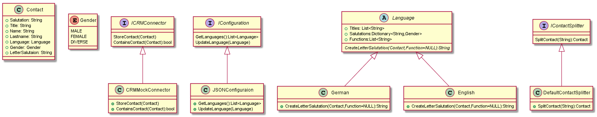

# Design und Architektur des Kontaktsplitters

Der Kontaktsplitter wird in der Sprache C# implementiert. Als UI-Framework dient WPF. Die grundlegende Architektur wird nach dem MVVM (Model-View-ViewModel) Konzept aufgebaut. 

## Klassendiagramm

## Schnittstellen
Das Interface `IContactSplitter` stellt mit `SplitContact(String)` eine Methode bereit, mit der eine Zeichenkette in einen Kontakt aufgeteilt werden kann. 

Die `ICRMConnector` Schnittstelle stellt Methoden bereit, über die aufgeteilte Kontakte im CRM-System abgelegt werden können sowie für eine Überprüfung, ob ein Kontakt bereits in diesem System hinterlegt ist.

Die Schnittstele `IConfiguration` ist verantwortlich die Konfigurationsdaten der jeweiligen Sprachen zu persistieren. Dies ist ein Dictionary von Anreden zum dazugehörigen Geschlecht, sowie einer Liste von Titeln und Funktionen (Ämter), die eine Kontakt annehmen kann. 

## Klassen
Die Kernklasse ist des Kontaktsplitters ist die Klasse `Contact`, welche Felder für Anrede, Titel, Vor- und Nachname sowie Sprache eines erkannten Kontaktes besitzt.

`DefaultContactSplitter` stellt eine standardmäßige Implementierung der Schnittstelle `IContactSplitter` bereit. Bei speziellen Anwendungsfällen kann der Kontaktsplitter später über weitere Split-Implementierungen erweitert werden.

Um Kontakte unterschiedlicher Sprachen verwalten und die Briefanrede in der jeweiligen Sprache zu erzeugen, existiert die Abstrakte Klasse  `Language`. Sie verwaltet die möglichen Titel, die möglichen Funktionen/Ämter sowie die Anreden  unterschiedlicher Geschlechter.

Implementierungen der Methode `GetLetterSalutation`, generieren für einen `Contact` eine Briefanrede in der jeweiligen Sprache generiert werden kann.
Kontakte können in den Sprachen Deutsch und Englisch erkannt werden. In diesen Sprachen kann auch eine Briefanrede generiert werden. Dies übernehmen die Klassen `German` und `English`, welche beide von  `Language` abgeleitet sind.  
Vollständige Briefanreden können nur in der eingegebenen Sprache erfolgen, in der auch Titel und Anrede eingegeben wurden (Die Sprache, die vom `IContactSplitter` erkannt wurde und im Attribut language der Klasse `Contact` hinterlegt ist). Für andere Sprache ist anhand von Geschlecht und Vor- und Nachname die Generierung einer vereinfachten Standardbriefanrede vorgesehen.  
Optional kann beim generieren einer Briefanrede auch eine Funktion angegeben werden, mit der die Kontaktperson angesprochen wird (z.B. Bürgermeister).

Die Klasse `JSONConfiguration` implementiert die Schnittstelle `IConfiguration` und nimmt anhand von JSON Konfigurationsdateien die Konfiguration der verfügbaren Sprachen vor.

Während der Entwicklung des Kontaktsplitters ist dieser noch nicht an das produktive CRM-System angebunden. Die Anbindung wird über die Klasse `CRMMockConnector` simuliert und kann später durch eine richtige Anbindung ersetzt werden.